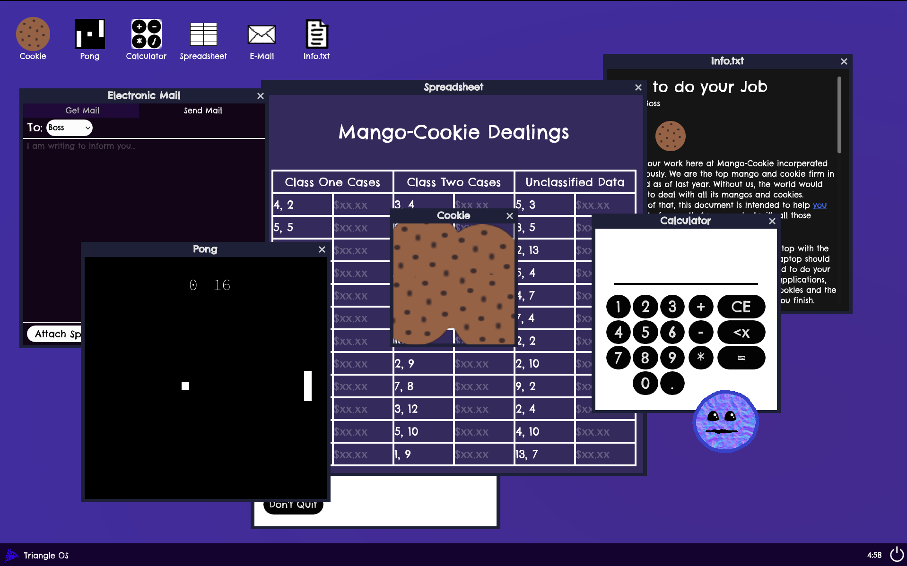
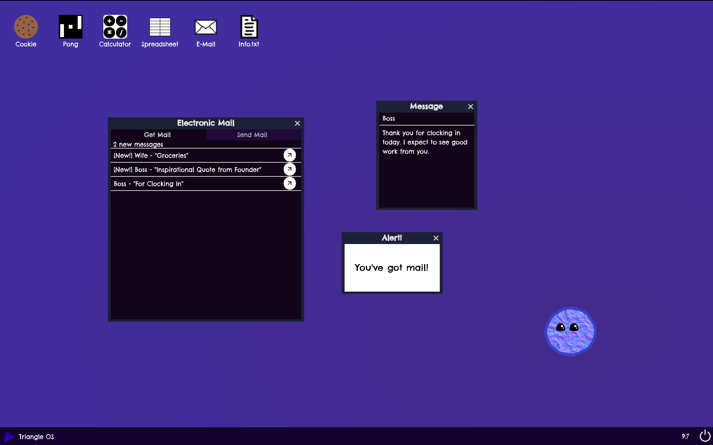

# Little Buddy!

### Intro
This is a game jam project about an "interesting" desktop assistant, developed by me, myself, and I.
Unlike my other jam projects, this demo's repo is visible for horizon purposes.
I didn't originally have the source code in a repo because I intended it to be quick and dirty.
For that reason, a significant amount of the code *is* quick and dirty, and a non-negligable chunk of the project was commited in a single commit. (All this work was after the start of horizons and the jam, but before I started logging time.)
Reguardless of if I finish my goals for the jam in time, I want to continue working with this project and will deem this portion the demo.

### Info
This game is available for both web and windows, but it is **__strongly__** reccomended that you choose the windows experience.
For web, there **__will__** be visual errors on any device with a resolution lower than 1536x864.
Additionally, other elements of the game will be more satisfying if not played on web.
For windows, any Windows 10/11 device should suffice.
<ss>
The desktop assistant in question, is inspired by Clippy. I have long wanted to make a game about some weird computer thing bugging you,
so I started this game for a jam with the theme "Companion."
This game, taking place on a virtual desktop, also gave me an opertunity to use some obscure Godot engine features which I hadn't ever gotten to use in their fullest before in a game.
The art for this game has also been fun to make, as most of it is just doodling on pixlr.
The sounds are perhapse what I'm most proud of. Every sound effect is foley or some instrumental jingle, reccorded live or composed in Musescore Studio 4.
All of this works in my opinion, very well to tell a very fun story in a very unique experience.
If you decide to play, let me know what you think. All feedback is valueble.

